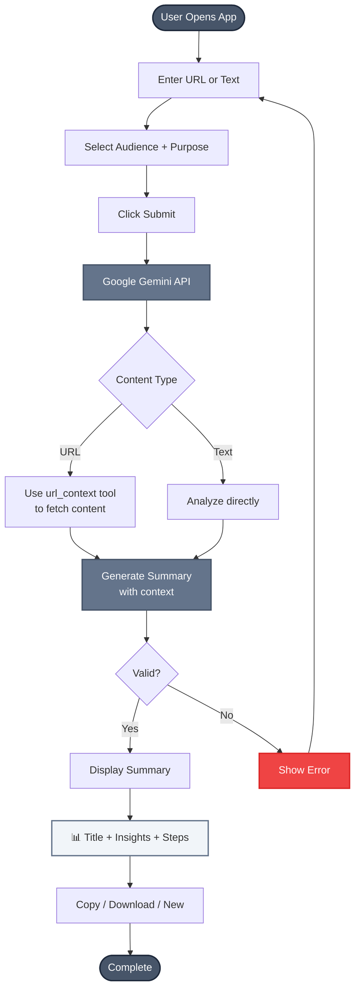
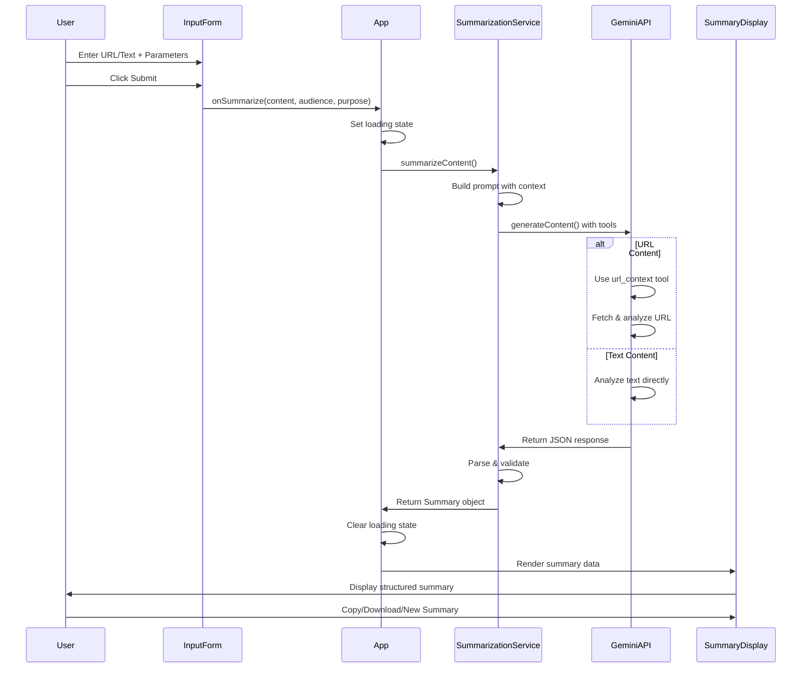
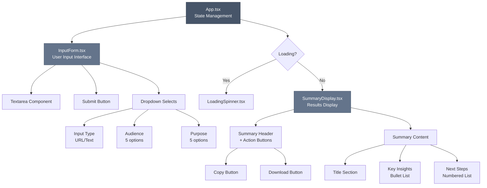

# Summarization Assistant - Workflow Diagram

## Application Flow



## Technology Stack

```mermaid
graph LR
    A[React 18 + TypeScript] --> B[Vite Dev Server]
    B --> C[Google Gemini API]
    C --> D[@google/genai SDK]
    
    A --> E[Component Structure]
    E --> F[App.tsx - Main Container]
    E --> G[InputForm.tsx - User Input]
    E --> H[SummaryDisplay.tsx - Results]
    E --> I[LoadingSpinner.tsx - Loading State]
    
    style A fill:#61dafb,stroke:#20232a,color:#000
    style C fill:#4285f4,stroke:#1a73e8,color:#fff
    style E fill:#f1f5f9,stroke:#64748b
```

## Data Flow



## Component Hierarchy



## Key Features

- **Single Page Application**: No routing, all interactions on one page
- **Real-time Processing**: Direct API calls to Google Gemini
- **Structured Output**: Consistent JSON format for all summaries
- **Responsive Design**: Mobile-friendly with modern UI
- **Export Options**: Copy to clipboard or download as text file
- **Parameter Customization**: 5 audience types × 5 purpose types = 25 combinations
